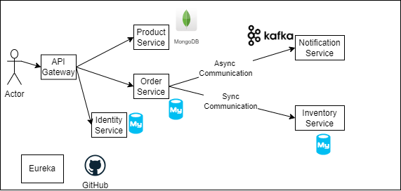

# Spring Boot Microservices - Shopping app

## Description: 
This Project provides shopping services, customer can login into the web app, view products and place orders. This app is build on microservices architecture
Below are the microservices
1. API Gateway
2. Identity Service
3. Discovery Service
4. Inventory Service
5. Order Service
6. Notification Service
7. Product Service

This app is secured by Spring security and JWT
Used Kafka MQ for Asyncronous communication

## Architecture
